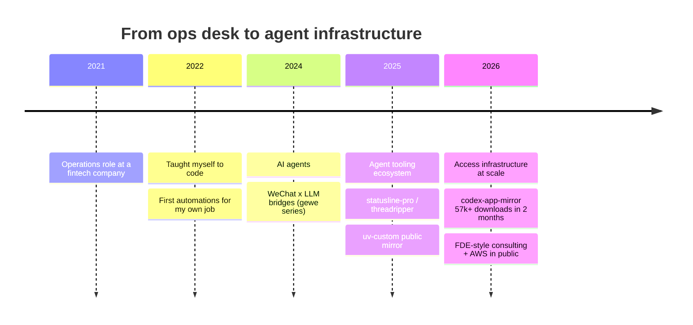

 

## 🧭 About me

- 🎓 Public-administration grad → fintech **operations** day job → taught myself to build, starting **2022**
- 🤖 Today: **AI Agent engineer & enterprise AI-native consultant** — FDE-style, embedded in real workflows, shipping agents that survive production
- 🪞 I build **verifiable mirror infrastructure** so developers behind network barriers get official tooling — the walls I hit became roads for others（为下一个 builder 拆掉我撞过的墙）
- 🛠 Agent tooling ecosystem for **Claude Code / Codex / OpenClaw**: CLIs, skills, statuslines, WeChat bridges
- ✍️ I write & speak in Chinese dev communities · reach me via GitHub Issues

> 🎯 **2026 focus** — porting my agent tooling to **AWS Bedrock + AgentCore** and documenting every step in Chinese, so the next self-taught builder ships faster than I did. re:Invent 2026 — see you there? 🎲

## 🚀 The journey so far

## 📊 Impact, live-counted

## 🧱 Featured builds

<table>
<tr>
<td align="center" width="50%">
<a href="https://github.com/Wangnov/codex-app-mirror"><picture><source media="(prefers-color-scheme: dark)" srcset="https://socialify.git.ci/Wangnov/codex-app-mirror/image?description=1&font=Inter&language=1&name=1&owner=1&pattern=Plus&stargazers=1&theme=Dark"></picture></a>
</td>
<td align="center" width="50%">
<a href="https://github.com/Wangnov/codex-threadripper"><picture><source media="(prefers-color-scheme: dark)" srcset="https://socialify.git.ci/Wangnov/codex-threadripper/image?description=1&font=Inter&language=1&name=1&owner=1&pattern=Plus&stargazers=1&theme=Dark"></picture></a>
</td>
</tr>
<tr>
<td align="center" width="50%">
<a href="https://github.com/Wangnov/claude-code-statusline-pro"><picture><source media="(prefers-color-scheme: dark)" srcset="https://socialify.git.ci/Wangnov/claude-code-statusline-pro/image?description=1&font=Inter&language=1&name=1&owner=1&pattern=Plus&stargazers=1&theme=Dark"></picture></a>
</td>
<td align="center" width="50%">
<a href="https://github.com/Wangnov/uv-custom"><picture><source media="(prefers-color-scheme: dark)" srcset="https://socialify.git.ci/Wangnov/uv-custom/image?description=1&font=Inter&language=1&name=1&owner=1&pattern=Plus&stargazers=1&theme=Dark"></picture></a>
</td>
</tr>
<tr>
<td align="center" width="50%">
<a href="https://github.com/Wangnov/Codex-App-Manager"><picture><source media="(prefers-color-scheme: dark)" srcset="https://socialify.git.ci/Wangnov/Codex-App-Manager/image?description=1&font=Inter&language=1&name=1&owner=1&pattern=Plus&stargazers=1&theme=Dark"></picture></a>
</td>
<td align="center" width="50%">
<a href="https://github.com/Wangnov/gewe-cc"><picture><source media="(prefers-color-scheme: dark)" srcset="https://socialify.git.ci/Wangnov/gewe-cc/image?description=1&font=Inter&language=1&name=1&owner=1&pattern=Plus&stargazers=1&theme=Dark"></picture></a>
</td>
</tr>
</table>

🗂 <b>Three product lines, one mission</b>

 

| Line | What | Why |
|---|---|---|
| 🪞 **Access infrastructure** | [codex-app-mirror](https://github.com/Wangnov/codex-app-mirror) · [claude-app-mirror](https://github.com/Wangnov/claude-app-mirror) · [uv-custom](https://github.com/Wangnov/uv-custom) | Verifiable (SHA256), auto-probed mirrors that unblock developers behind network barriers |
| 🛠 **Agent tooling** | [codex-threadripper](https://github.com/Wangnov/codex-threadripper) · [claude-code-statusline-pro](https://github.com/Wangnov/claude-code-statusline-pro) · [Codex-App-Manager](https://github.com/Wangnov/Codex-App-Manager) · [codex-asr](https://github.com/Wangnov/codex-asr) · [gpt-image-2-skill](https://github.com/Wangnov/gpt-image-2-skill) · [grok-skills](https://github.com/Wangnov/grok-skills) | CLIs, skills and plugins that make coding agents sharper |
| 💬 **Agent ↔ messaging bridges** | [gewe-cc](https://github.com/Wangnov/gewe-cc) · [gewe-openclaw](https://github.com/Wangnov/gewe-openclaw) · [gewe-skill](https://github.com/Wangnov/gewe-skill) · [rust-silk](https://github.com/Wangnov/rust-silk) | Two-way WeChat channels for AI agents, down to the voice codec |

## 🧰 Arsenal

 

## 📈 Stats

  

  

  

## 🐍 Contribution snake

<picture>
  <source media="(prefers-color-scheme: dark)" srcset="https://raw.githubusercontent.com/Wangnov/Wangnov/output/github-contribution-grid-snake-dark.svg">
  <source media="(prefers-color-scheme: light)" srcset="https://raw.githubusercontent.com/Wangnov/Wangnov/output/github-contribution-grid-snake.svg">
  
</picture>

*"The walls you hit are just roads waiting to be built for someone else."*

